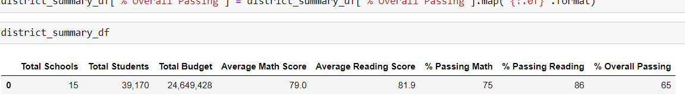
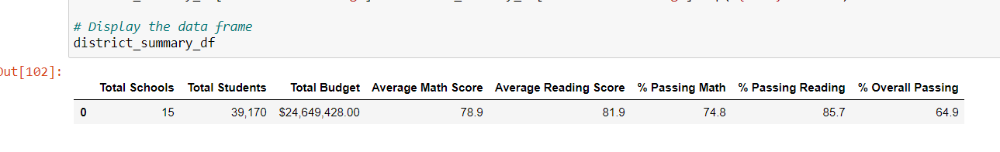
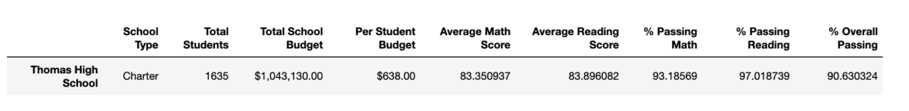
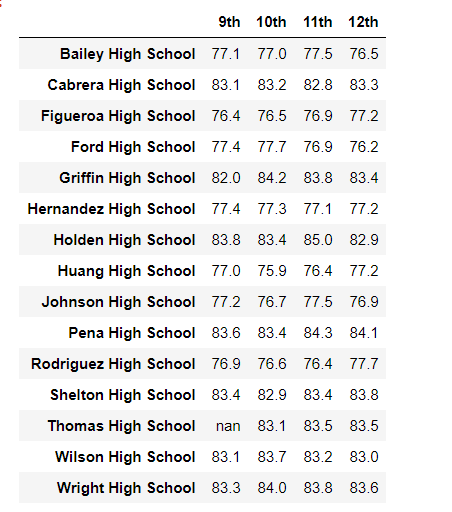
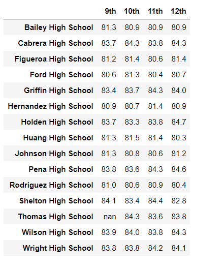
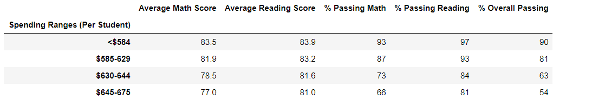
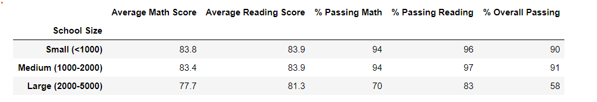
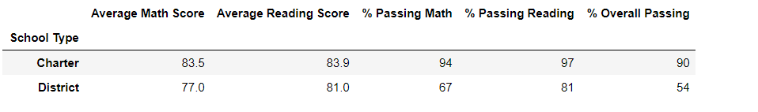

# School_District_Analysis
Weekly Analysis-4 Analyze the school data and showcase trends for deciding the upcoming school budget.

## Overview of the Project

### Purpose and Backgroud

The purpose of this analysis is to help Maria,the chief data scientist for a city school with analysis of the students and school data to make some strategic decisions on 
school funding at the school and district level. We will perform our analysis on aggregated data and showcase trends in school performance. Also in the process we need to clean
and modify our data so that chances of errors are minimized. We will do an exploratory analysis on our students and school data to summarize the main traits of the dataset.
The key points in this analysis project is to determin ethe following:
- A summary of the district's key metrics presented in the form of a tble.
- A summary of the key metrics of each school presented in a table format.
- An analysis determining the top five and bottom performing schools based on the overall passing percentages.
- The averages of the math and reading score received by students in each grade level at each school.
- The performance of the school based on the budget per student.
- The performance of the school based on the school size or the number of students in each school.
- The performance of the school based on whether its a district or charter school.

Also the school board has found that the grades of the Thomas High School, 9th grade students have been altered for the reading and math scores. So in our analysis we will
replace these data and then perform our analysis.We will then summarize and report the changes and its imapct on our analysis.

## Results

1.How is the district summary affected?

During our calculation of district level summary statistics we subtracted the 9th garde students of Thomas High School from the total student count,as these students did not have 
any grades and their scores were replaced by null values. So we performed our analysis taking into account the new total student count.
As we can see from the snapshots below the change in district level summary is very less as comapared to previous district level summary.
The average scores and the passing percentage for all the schools is almost same with very small changes.
So we can say that removing the 9th grade students of Thomas High School from our total student count did not affect the overall passing percentage and the average scores
to a large extent. The changes were minimal.

District level summary:

District level updated summary:

2.How is the school summary affected?

- First we created a school summary statistics by including the 9th grade students from Thomas High School.
- But due to discrepancy we have replaced their scores in math and reading with null, so they do not have any scores.
- Since we included them in our calculations , we can see from the snapshot below the overall passing percentage of Thomas High School has fallen from 90.94% to 65.07%.
- Also the percentage of students passing in math and reading for Thomas High School has fallen drastically.
- The average scores in math and reading remain almost same because the average calculation does not include the number of students in the school.
- The other school summary remains the same without any changes.

- Secondly we created a school summary statistics by including only the 10th to 12th grade students from Thomas High school.
- Since the 9th grade students are not included in the calculations, the overall passing percentage was same for Thomas high school.
- Also the passing percentage for math and reading was same.

Thomas school updated metrics(including 9th grade students) :

Thomas school metrics (including only 10th to 12th grade students) :

3.How does replacing the ninth graders’ math and reading scores affect Thomas High School’s performance relative to the other schools?

- Replacing the ninth graders’ math and reading scores of Thomas High School’s with NaN values affected the overall passing percentage of Thomas High School and it has
  fallen drastically as compared to other schools.
- Also the passing percentage for math and reading for Thomas high school has fallen as comapred to other schools.
This is because the scores of 9th grade students of Thomas high school is null and and if we include those students in our calculations , there will be an overall
decrease in these statistics.

4.How does replacing the ninth-grade scores affect the following:
- Math and reading scores by grade

 There is no major impact on the math and reading scores by grade level. As we can see only the 9th grade level for Thomas High School is replaced by NaN and all other
 values remain the same.

Grade level math score updated :

Grade level reading score updated:

- Scores by school spending
 There is no impact of replacing the 9th grade scores on scores by school spending.
 Thomas High School came under $630-644 range and as we can see from the snapshot below the average scores and overall average passing percentage is the same.
 This is because we have replaced the scores of THomas school with only 10th to 12th grades score, so it does not impact our analysis.

- Scores by school size
 There is no impact of replacing 9th grade scores on the scores depending on school size.
  

- Scores by school type
 There is no impact of replacing 9th grade scores on the scores depending on school type.
 
 

##Summary

  After reading and math scores for the ninth grade at Thomas High School have been replaced with NaNs following changes have been observed in updated school district
  analysis:
  
  1.The percentage of students passing in math has fallen from 93.27% to 66.9% for Thomas high school.

  2.The percentage of students passing in reading has fallen from 97.3% to 69.6% for Thomas high school.

  3.The overall passing percentage for Thomas High School has fallen from 90.9% to 65%.

  4.For the grade level summary of scores for each school the 9th grade scores for Thomas High School has been replaced with null values.

